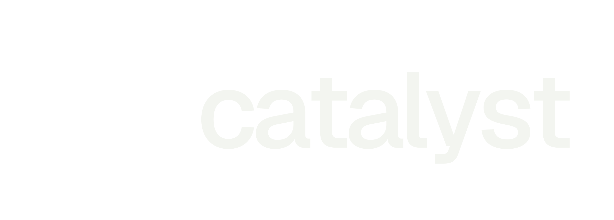
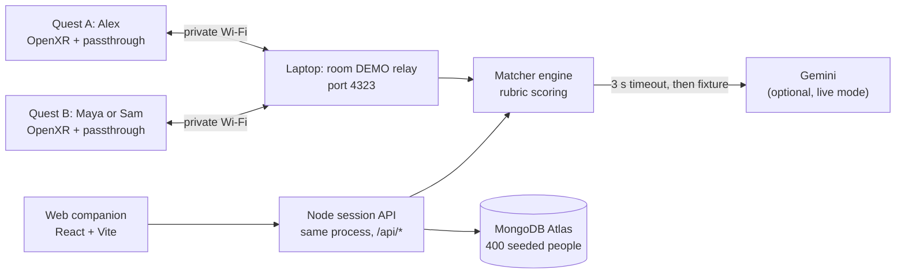

<p align="center">
  
</p>

<h3 align="center">Your people. In plain sight.</h3>

<p align="center">
  A colocated mixed-reality networking experience for events. Look at someone through your headset, see a shared green cue and one reason to say hello.
</p>

<p align="center">
  <a href="https://catalystathackgt.vercel.app">Live web demo</a>
  &nbsp;·&nbsp;
  <a href="assets/LAPTOP_RELAY_DEMO.md">Two-headset demo guide</a>
  &nbsp;·&nbsp;
  <a href="assets/match-prd.md">Product spec</a>
</p>

<p align="center">
  
  
  
  
  
  
</p>

<sub align="center"><i>Formerly known as Align. The Unity project, APK filename, and Android package still use the Align name.</i></sub>

---

## The pitch

Big events put you in a room with the right people and no reliable way to find them. Catalyst puts an invisible layer on top of the room: when two people wearing Quest 2 headsets look at each other, they see the other person's name and, when their interests align, the same green cue and one specific reason to start a conversation. Nothing about the other person is inferred from their face, their posture, or a camera image; you only see people who chose to wear a headset and join the room.

## Try it in a browser

The [live web demo](https://catalystathackgt.vercel.app) is the full companion experience with 400 seeded attendees backed by MongoDB Atlas. No headset needed.

1. Open the site and choose **Try the demo**.
2. Continue with the prepared **Alex** profile.
3. Explore Home, Events, Network, and Profile.
4. Open **Spatial preview** and enter `DEMO` to walk through the room in your browser.

## Screenshots

<table>
  <tr>
    <td width="50%"></td>
    <td width="50%"></td>
  </tr>
  <tr>
    <td width="50%"></td>
    <td width="50%"></td>
  </tr>
</table>

## How it works



- **Calibration.** Both wearers stand on a shared marker and press A or X. After calibration, A or X hides or shows their own card. B or Y on the second headset switches Maya and Sam for a nonmatch demo.
- **The card.** A viewer-fixed glass panel 1.35 m in front of the wearer, 64 cm wide, with black type on a translucent surface. On a match the same panel tints pale green and reveals one conversation starter.
- **The score.** Six weighted networking categories score 0 to 100 against the [team rubric](assets/align-matching-rubric.md). Anything at 70 or above is a match. Judges never see the number.
- **The judged run.** `npm run start:demo` in `matcher/` forces the bundled fixture with no Gemini call, so the demo works with no internet. Live mode calls Gemini with a 3 s deadline and falls back to the same fixture result.

## Privacy and safety

- Only fictional demo profiles (Alex, Maya, Sam) go on the Quest. There is no login on the headset.
- No facial recognition, no camera pixels, no inference about who is in the room. The Quest 2 app never requests passthrough image frames. Only people wearing a connected headset are represented.
- Contact and social links never travel to Gemini. They are user-provided display fields, not matching inputs.
- The private-LAN relay has no authentication and is meant for a private demo network only.
- Run the demo in a marked, obstacle-free area with passthrough and headset boundaries enabled.

## Tech stack

**Headset**
- Unity `6000.0.66f2`, C#, Unity OpenXR + Unity OpenXR: Meta
- Meta Quest 2 passthrough (AR Foundation, no camera-frame access)
- TextMeshPro world-space canvases
- `HttpRoomTransport` today; Photon Fusion Shared Mode planned

**Backend and AI**
- Node.js 20.6+, zero-dependency HTTP matcher (`matcher/`)
- Rules-based rubric with an optional Gemini structured-JSON adapter and a 3-second fallback
- Private-LAN room relay at `POST /room/update`

**Web companion**
- React 19, TypeScript, Vite
- Node HTTP session API deployed as a Vercel serverless function
- MongoDB Atlas for the 400-person seeded catalogue, with an in-memory fallback for tests

## Run it locally

**Web companion**

```sh
cd web
npm ci
npm run dev
```

Then open `http://127.0.0.1:4320`. Use the Alex profile and room code `DEMO`. See [web/README.md](web/README.md) for the API port, tests, and the `MONGODB_URI` env var.

**Matcher**

```sh
cd matcher
npm run start:demo
```

This is the deterministic judged-demo path: fixture only, no Gemini, no `.env`. Live-first mode and the LAN relay watcher are in [matcher/README.md](matcher/README.md).

**Unity client**

1. Open the `unity/` folder in Unity `6000.0.66f2` with Android Build Support installed.
2. Start the matcher first.
3. Choose **Align → Setup → Configure Quest Project**, then **Align → Build → Build Quest APK**.

The build lands in `unity/Builds/Quest/Align.apk`. Full setup, controller mapping, and EditMode tests are in [unity/README.md](unity/README.md).

## Repo map

| Folder | What lives here |
| --- | --- |
| [`unity/`](unity/) | Mixed-reality client, Quest scenes, EditMode tests, generated APKs |
| [`matcher/`](matcher/) | Node HTTP matching service, rubric, Gemini adapter, LAN room relay |
| [`web/`](web/) | React + Vite companion site and Vercel deployment |
| [`assets/`](assets/) | Rubric, PRD, task plan, demo fixtures, laptop-relay walkthrough |

## Team

Built at HackGT as a 24-hour Meta Quest 2 hackathon MVP. Ownership from [assets/TASKS.md](assets/TASKS.md):

- **Quest / MR lead** — Unity project, Quest builds, passthrough, profile-card rendering
- **Multiplayer / spatial lead** — Room networking, pose sync, interpolation, calibration
- **Backend / AI lead** — Profile and match schema, matcher API, Gemini adapter, deterministic fallback, MongoDB catalogue
- **UX / demo / integration lead** — Profile creation UI, preset and demo flow, match states, recovery controls, QA

## Documentation

- [Cable-free laptop relay setup and demo walkthrough](assets/LAPTOP_RELAY_DEMO.md)
- [Product requirements](assets/match-prd.md)
- [24-hour execution plan](assets/TASKS.md)
- [Matching rubric](assets/align-matching-rubric.md)
- [Unity client setup](unity/README.md)
- [Quest matcher and Unity handoff](matcher/README.md)
- [Interactive web companion](web/README.md)
