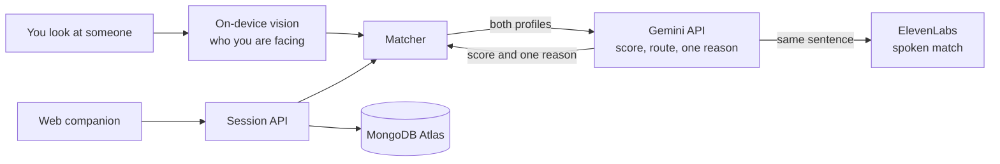

<p align="center">
  
</p>

<h3 align="center">Your people. In plain sight.</h3>

<p align="center">
  A colocated mixed-reality networking experience for events. Look at someone through your headset, see a shared green cue and one reason to say hello.
</p>

<p align="center">
  <a href="https://catalystathackgt.vercel.app">Live web demo</a>
  &nbsp;·&nbsp;
  <a href="assets/LAPTOP_RELAY_DEMO.md">Two-headset demo guide</a>
  &nbsp;·&nbsp;
  <a href="assets/match-prd.md">Product spec</a>
</p>

<p align="center">
  
  
  
  
  
</p>

<sub align="center"><i>Formerly known as Align. The Unity project, APK filename, and Android package still use the Align name.</i></sub>

---

## The pitch

Big events put you in a room with the right people and no reliable way to find them. Catalyst is built for the Meta track: use AI to bring people together. Gemini is the matcher. It reads what both people actually wrote about themselves and returns one shared result, a match or a quiet nonmatch, plus a single concrete reason to start talking. Both people see the same cue. Nobody gets ranked in public.

The form factor this is for is glasses you can wear while you talk: Meta Ray-Ban glasses and newer Meta headsets. Look at someone, hear or see one reason to say hello, keep walking. No controllers. Computer vision finds the person you are looking at among people who opted into the event; Gemini decides if you have a reason to meet. We shipped the working two-person demo on Quest 2 because that is the hardware we had. A full headset covers your face, which is the wrong shape for walking up to someone. The Quest build proves the match. Glasses are where it belongs.

## Try it in a browser

The [live web demo](https://catalystathackgt.vercel.app) is the full companion experience with 400 seeded attendees backed by MongoDB Atlas. No headset needed.

1. Open the site and choose **Try the demo**.
2. Continue with the prepared **Alex** profile.
3. Explore Home, Events, Network, and Profile.
4. Open **Spatial preview** and enter `DEMO` to walk through the room in your browser.

## Screenshots

<table>
  <tr>
    <td width="50%"></td>
    <td width="50%"></td>
  </tr>
  <tr>
    <td width="50%"></td>
    <td width="50%"></td>
  </tr>
</table>

## How it works



- **Look, then hear.** You look at someone who opted into the event. Vision on the glasses finds who you are facing. You do not press anything. The Quest demo used controllers only because that headset has no better way to say "this person."
- **Gemini does the matching.** This project is in the Gemini API track. Gemini receives both profiles and returns structured JSON: a 0–100 score across the six [rubric](assets/align-matching-rubric.md) categories, the route it took, and one conversation starter grounded in what both people wrote. A score of 70 or above is a match. You hear or see the sentence. Nobody sees the number.
- **A deadline, then the same rubric.** The call has a 3-second budget so two people are not standing there waiting. If Gemini is slow or the response fails the schema, the rubric returns the same shape of result. `npm run start:demo` is that offline path. Live matching is Gemini.
- **Spoken, for people who cannot read a card.** The match is already one short sentence. ElevenLabs says who this person is and why you should say hello. Someone with low vision hears the introduction instead of hunting for a panel. That is why the output is a sentence, not a dashboard.

## Privacy

You only match with people who opted into the event. Gemini sees the interests, skills, and experiences they wrote, never contact or social links. The score stays private. The cue and the sentence are what both of you get.

## Tech stack

**Where it runs**
- Built for Meta Ray-Ban glasses and newer Meta headsets: look at someone, hear a match, keep talking
- Hackathon demo on Meta Quest 2 (Unity `6000.0.66f2`, OpenXR, passthrough) to prove a shared room and an AI match
- On-device vision to find who you are looking at; ElevenLabs speaks the Gemini sentence so you do not have to read a card

**Matching**
- Gemini API (`gemini-3.8-flash`) returns structured JSON: score, route, and one conversation starter
- Node.js 20.6+ matcher (`matcher/`) enforces the schema, a 3-second deadline, and the rubric fallback
- ElevenLabs speaks that same sentence so a low-vision wearer hears the match instead of reading a card

**Web companion**
- React 19, TypeScript, Vite
- Node HTTP session API deployed as a Vercel serverless function
- MongoDB Atlas for the 400-person seeded catalogue, with an in-memory fallback for tests

## Run it locally

**Web companion**

```sh
cd web
npm ci
npm run dev
```

Then open `http://127.0.0.1:4320`. Use the Alex profile and room code `DEMO`. See [web/README.md](web/README.md) for the API port, tests, and the `MONGODB_URI` env var.

**Matcher**

```sh
cd matcher
npm run start:demo
```

This forces the rubric fixture so a judged run still finishes with no network. The live path, which calls Gemini, is `npm run start:env` with a key in `.env`. Setup is in [matcher/README.md](matcher/README.md).

**Unity client**

1. Open the `unity/` folder in Unity `6000.0.66f2` with Android Build Support installed.
2. Start the matcher first.
3. Choose **Align → Setup → Configure Quest Project**, then **Align → Build → Build Quest APK**.

The build lands in `unity/Builds/Quest/Align.apk`. Full setup, controller mapping, and EditMode tests are in [unity/README.md](unity/README.md).

## Repo map

| Folder | What lives here |
| --- | --- |
| [`unity/`](unity/) | Mixed-reality client, Quest scenes, EditMode tests, generated APKs |
| [`matcher/`](matcher/) | Node HTTP matching service, rubric, Gemini adapter, LAN room relay |
| [`web/`](web/) | React + Vite companion site and Vercel deployment |
| [`assets/`](assets/) | Rubric, PRD, task plan, demo fixtures, laptop-relay walkthrough |

## Team

Built at HackGT for the Meta track and the Gemini API track. Ownership from [assets/TASKS.md](assets/TASKS.md):

- **Quest / MR lead** — Unity project, Quest builds, passthrough, profile-card rendering
- **Multiplayer / spatial lead** — Room networking, pose sync, interpolation, calibration
- **Backend / AI lead** — Profile and match schema, Gemini matching, rubric fallback, MongoDB catalogue
- **UX / demo / integration lead** — Profile creation UI, preset and demo flow, match states, recovery controls, QA

## Documentation

- [Cable-free laptop relay setup and demo walkthrough](assets/LAPTOP_RELAY_DEMO.md)
- [Product requirements](assets/match-prd.md)
- [24-hour execution plan](assets/TASKS.md)
- [Matching rubric](assets/align-matching-rubric.md)
- [Unity client setup](unity/README.md)
- [Quest matcher and Unity handoff](matcher/README.md)
- [Interactive web companion](web/README.md)
