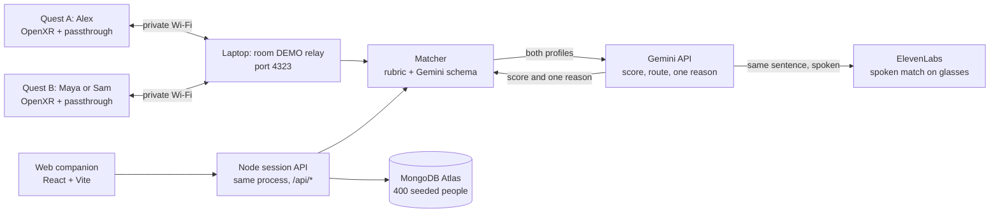

<p align="center">
  
</p>

<h3 align="center">Your people. In plain sight.</h3>

<p align="center">
  AI that brings people together in the same room. Gemini reads both profiles and gives both of you the same green cue and one reason to say hello.
</p>

<p align="center">
  <a href="https://catalystathackgt.vercel.app">Live web demo</a>
  &nbsp;·&nbsp;
  <a href="assets/LAPTOP_RELAY_DEMO.md">Two-headset demo guide</a>
  &nbsp;·&nbsp;
  <a href="assets/match-prd.md">Product spec</a>
</p>

<p align="center">
  
  
  
  
  
</p>

<sub align="center"><i>Formerly known as Align. The Unity project, APK filename, and Android package still use the Align name.</i></sub>

---

## The pitch

Big events put you in a room with the right people and no reliable way to find them. Catalyst is built for the Meta track: use AI to bring people together. Gemini is the matcher. It reads what both people actually wrote about themselves and returns one shared result, a match or a quiet nonmatch, plus a single concrete reason to start talking. Both people see the same cue. Nobody gets ranked in public.

The form factor this is for is glasses you can wear while you have a conversation: Meta Ray-Ban glasses and the newer Meta headsets, where your face stays visible and the match can live in your ear. We shipped the working demo on Quest 2 because that is the hardware we had in the room. A full headset is a weak networking device. It covers your face, and the whole point is to look at someone and say hello. Quest 2 was enough to prove passthrough, a shared room, and an AI match card. Glasses are where it belongs.

Nothing about the other person is inferred from their face, their posture, or a camera image. You only meet people who chose to join the room.

## Try it in a browser

The [live web demo](https://catalystathackgt.vercel.app) is the full companion experience with 400 seeded attendees backed by MongoDB Atlas. No headset needed.

1. Open the site and choose **Try the demo**.
2. Continue with the prepared **Alex** profile.
3. Explore Home, Events, Network, and Profile.
4. Open **Spatial preview** and enter `DEMO` to walk through the room in your browser.

## Screenshots

<table>
  <tr>
    <td width="50%"></td>
    <td width="50%"></td>
  </tr>
  <tr>
    <td width="50%"></td>
    <td width="50%"></td>
  </tr>
</table>

## How it works



- **Calibration.** Both wearers stand on a shared marker and press A or X. After calibration, A or X hides or shows their own card. B or Y on the second headset switches Maya and Sam for a nonmatch demo.
- **The card.** A viewer-fixed glass panel 1.35 m in front of the wearer, 64 cm wide, with black type on a translucent surface. On a match the same panel tints pale green and reveals one conversation starter.
- **Gemini does the matching.** This project is in the Gemini API track, and the model is the product, not a plug-in. Gemini receives both profiles and must return structured JSON: a 0–100 score across the six [rubric](assets/align-matching-rubric.md) categories, the route it took, and one conversation starter grounded in what both people wrote. A score of 70 or above is a match. The headset shows the cue and the sentence. It never shows the number.
- **A deadline, then the same rubric.** The call has a 3-second budget so two people are not standing there waiting on a model. If Gemini is slow, unreachable, or returns something that fails the schema, the deterministic rubric returns the same shape of result. `npm run start:demo` forces that path so a judged run still completes with no network. Live matching is the Gemini call.
- **Spoken, for people who cannot read the card.** The match is already one short sentence. On Ray-Ban glasses that sentence does not have to be read. ElevenLabs turns it into speech: who this person is, and why you should say hello. Someone with low vision hears the introduction instead of hunting for a floating panel. The Quest build draws the card because that is what this headset can show. The same Gemini sentence is what the glasses would say. That is the accessibility path, and it is why the output is a sentence instead of a dashboard.

## Privacy and safety

- Only fictional demo profiles (Alex, Maya, Sam) go on the Quest. There is no login on the headset.
- No facial recognition, no camera pixels, no inference about who is in the room. The Quest 2 app never requests passthrough image frames. Only people wearing a connected headset are represented.
- Contact and social links never travel to Gemini. They are user-provided display fields, not matching inputs.
- The private-LAN relay has no authentication and is meant for a private demo network only.
- Run the demo in a marked, obstacle-free area with passthrough and headset boundaries enabled.

## Tech stack

**Where it runs**
- Built for Meta Ray-Ban glasses and newer Meta headsets, where you can still see the other person's face and hear a match in your ear
- Demo hardware is Meta Quest 2: Unity `6000.0.66f2`, C#, Unity OpenXR + Unity OpenXR: Meta, passthrough with no camera-frame access
- TextMeshPro world-space canvases for the glass match card
- `HttpRoomTransport` today; Photon Fusion Shared Mode planned

**Matching**
- Gemini API (`gemini-3.8-flash`) returns structured JSON: score, route, and one conversation starter
- Node.js 20.6+ matcher (`matcher/`) enforces the schema, a 3-second deadline, and the rubric fallback
- ElevenLabs speaks that same sentence on glasses, so a low-vision wearer hears the match instead of reading a card
- Private-LAN room relay at `POST /room/update`

**Web companion**
- React 19, TypeScript, Vite
- Node HTTP session API deployed as a Vercel serverless function
- MongoDB Atlas for the 400-person seeded catalogue, with an in-memory fallback for tests

## Run it locally

**Web companion**

```sh
cd web
npm ci
npm run dev
```

Then open `http://127.0.0.1:4320`. Use the Alex profile and room code `DEMO`. See [web/README.md](web/README.md) for the API port, tests, and the `MONGODB_URI` env var.

**Matcher**

```sh
cd matcher
npm run start:demo
```

This forces the rubric fixture so a judged run still finishes with no network. The live path, which calls Gemini, is `npm run start:env` with a key in `.env`. Setup is in [matcher/README.md](matcher/README.md).

**Unity client**

1. Open the `unity/` folder in Unity `6000.0.66f2` with Android Build Support installed.
2. Start the matcher first.
3. Choose **Align → Setup → Configure Quest Project**, then **Align → Build → Build Quest APK**.

The build lands in `unity/Builds/Quest/Align.apk`. Full setup, controller mapping, and EditMode tests are in [unity/README.md](unity/README.md).

## Repo map

| Folder | What lives here |
| --- | --- |
| [`unity/`](unity/) | Mixed-reality client, Quest scenes, EditMode tests, generated APKs |
| [`matcher/`](matcher/) | Node HTTP matching service, rubric, Gemini adapter, LAN room relay |
| [`web/`](web/) | React + Vite companion site and Vercel deployment |
| [`assets/`](assets/) | Rubric, PRD, task plan, demo fixtures, laptop-relay walkthrough |

## Team

Built at HackGT for the Meta track and the Gemini API track. Ownership from [assets/TASKS.md](assets/TASKS.md):

- **Quest / MR lead** — Unity project, Quest builds, passthrough, profile-card rendering
- **Multiplayer / spatial lead** — Room networking, pose sync, interpolation, calibration
- **Backend / AI lead** — Profile and match schema, Gemini matching, rubric fallback, MongoDB catalogue
- **UX / demo / integration lead** — Profile creation UI, preset and demo flow, match states, recovery controls, QA

## Documentation

- [Cable-free laptop relay setup and demo walkthrough](assets/LAPTOP_RELAY_DEMO.md)
- [Product requirements](assets/match-prd.md)
- [24-hour execution plan](assets/TASKS.md)
- [Matching rubric](assets/align-matching-rubric.md)
- [Unity client setup](unity/README.md)
- [Quest matcher and Unity handoff](matcher/README.md)
- [Interactive web companion](web/README.md)
