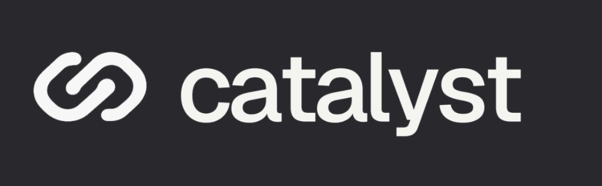
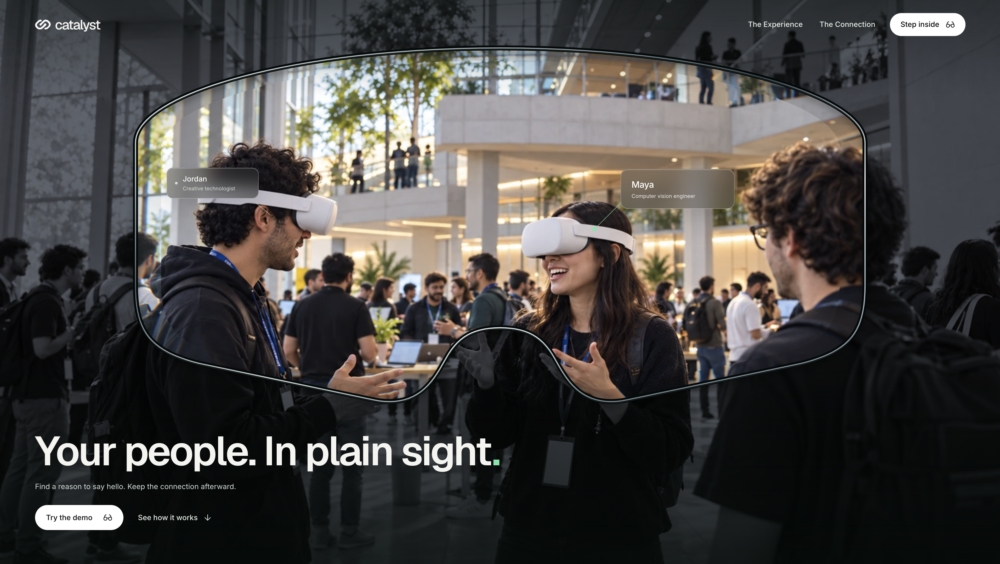
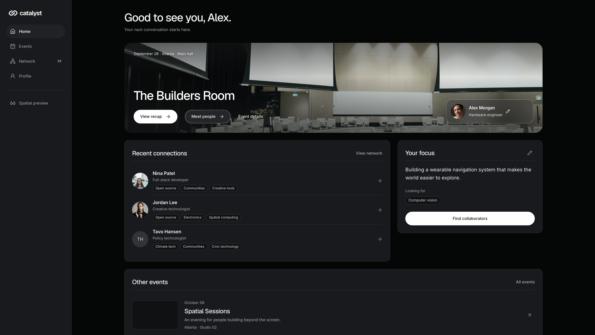
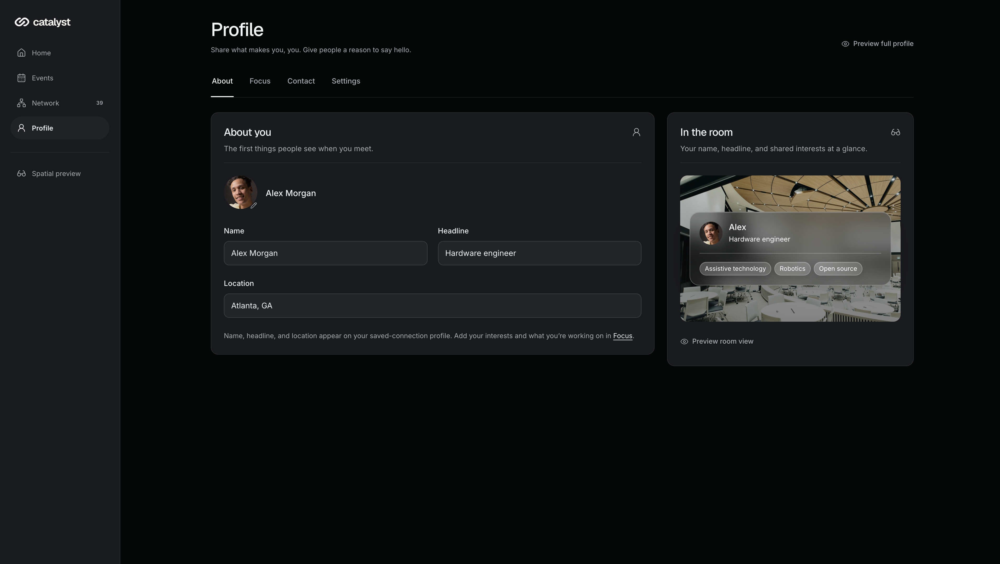
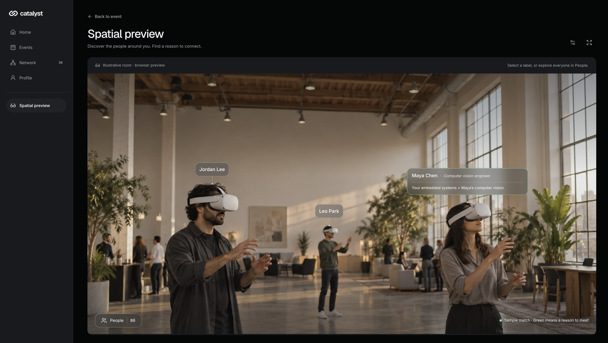
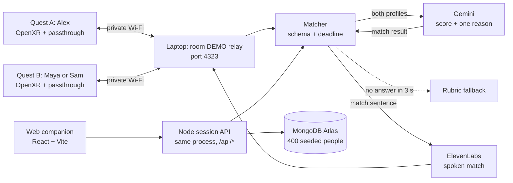

<p align="center">
  
</p>
<h3 align="center">Your people. In plain sight.</h3>
 
<p align="center">
  A colocated mixed-reality networking experience for events. Look at someone through your headset, see a shared green cue and one reason to say hello.
</p>
<p align="center">
  <a href="https://catalystathackgt.vercel.app">Live web demo</a>
  &nbsp;·&nbsp;
  <a href="assets/LAPTOP_RELAY_DEMO.md">Two-headset demo guide</a>
  &nbsp;·&nbsp;
  <a href="assets/match-prd.md">Product spec</a>
</p>
<p align="center">
  
  
  
  
  
  
  
</p>
<sub align="center"><i>Formerly known as Align. The Unity project, APK filename, and Android package still use the Align name.</i></sub>
 
---
 
## The pitch
 
Big events put you in a room with the right people and no reliable way to find them.
 
Catalyst puts an invisible layer on top of the room. Two people in headsets look at each other. Gemini reads what both of them wrote about themselves and decides if they should meet. On a match, both see the other person's name, the same green cue, and one specific reason to start talking. ElevenLabs says that reason out loud. No match? Nothing shows up. Neither person learns who the other is.
 
We built the demo on Meta Quest 2 because that's the hardware we had. The real home for this is glasses you wear while you talk, like Meta Ray-Bans. A headset covers your face. Glasses don't. The Quest build proves the match works.
 
## Try it in a browser
 
The [live web demo](https://catalystathackgt.vercel.app) is the full companion experience with 400 seeded attendees backed by MongoDB Atlas. No headset needed.
 
1. Open the site and choose **Try the demo**.
2. Continue with the prepared **Alex** profile.
3. Explore Home, Events, Network, and Profile.
4. Open **Spatial preview** and enter `DEMO` to walk through the room in your browser.
## Screenshots
 
<table>
  <tr>
    <td width="50%"></td>
    <td width="50%"></td>
  </tr>
  <tr>
    <td width="50%"></td>
    <td width="50%"></td>
  </tr>
</table>

## How it works
 

 - **Gemini does the matching.** It gets both profiles and returns structured JSON: a 0 to 100 score across the six categories in the [matching rubric](assets/align-matching-rubric.md), plus one conversation starter grounded in what both people wrote. 70 or above is a match. Nobody ever sees the number.
- **The card.** A viewer-fixed glass panel 1.35 m in front of the wearer, 64 cm wide, black type on a translucent surface. On a match it tints pale green and shows the other person's name and the conversation starter. On a nonmatch it stays empty.
- **The voice.** On a match, ElevenLabs reads the starter aloud. Your eyes stay on the person, not the panel. A low-vision wearer hears the intro instead of hunting for text.
- **The fallback.** Gemini gets a 3-second deadline so nobody stands around waiting. If it's slow or the response breaks the schema, the rubric returns the same shape of result. `npm run start:demo` forces that offline path so the demo still runs with no internet.
## Privacy and safety
 
- **No match, no reveal.** If Gemini decides you don't match, the other person sees nothing about you. Not your name, not your profile, not a score.
- The score is never shown to anyone, match or not.
- Gemini only sees the interests, skills, and experiences people wrote. Contact and social links never leave the device. They are display fields, not matching inputs.
- No facial recognition, no camera pixels, no inference about who is in the room. The Quest 2 app never requests passthrough image frames. Only people wearing a connected headset are represented.
- The private-LAN relay has no authentication and is meant for a private network only.
## Tech stack
 
**Matching and voice**
- Gemini (`gemini-3.8-flash`) scores each pair and writes the conversation starter as structured JSON
- ElevenLabs turns the match sentence into speech on the headset
- Node.js 20.6+ zero-dependency matcher (`matcher/`) enforces the schema, the 3-second deadline, and the rubric fallback
- Private-LAN room relay at `POST /room/update`
**Headset**
- Unity `6000.0.66f2`, C#, Unity OpenXR + Unity OpenXR: Meta
- Meta Quest 2 passthrough (AR Foundation, no camera-frame access)
- TextMeshPro world-space canvases
- `HttpRoomTransport` today; Photon Fusion Shared Mode planned
**Web companion**
- React 19, TypeScript, Vite
- Node HTTP session API deployed as a Vercel serverless function
- MongoDB Atlas for the 400-person seeded catalogue, with an in-memory fallback for tests
## Run it locally
 
**Web companion**
 
```sh
cd web
npm ci
npm run dev
```
 
Then open `http://127.0.0.1:4320`. Use the Alex profile and room code `DEMO`. See [web/README.md](web/README.md) for the API port, tests, and the `MONGODB_URI` env var.
 
**Matcher**
 
```sh
cd matcher
npm run start:env
```
 
This is the live path. Gemini does the matching and ElevenLabs speaks the result. Put both API keys in `.env` first.
 
No network? `npm run start:demo` forces the rubric fixture so the run still finishes. The LAN relay watcher and key setup are in [matcher/README.md](matcher/README.md).
 
**Unity client**
 
1. Open the `unity/` folder in Unity `6000.0.66f2` with Android Build Support installed.
2. Start the matcher first.
3. Choose **Align → Setup → Configure Quest Project**, then **Align → Build → Build Quest APK**.
The build lands in `unity/Builds/Quest/Align.apk`. Full setup, controller mapping, and EditMode tests are in [unity/README.md](unity/README.md).
 
## Repo map
 
| Folder | What lives here |
| --- | --- |
| [`unity/`](unity/) | Mixed-reality client, Quest scenes, EditMode tests, generated APKs |
| [`matcher/`](matcher/) | Node HTTP matching service, Gemini adapter, ElevenLabs voice, rubric fallback, LAN room relay |
| [`web/`](web/) | React + Vite companion site and Vercel deployment |
| [`assets/`](assets/) | Rubric, PRD, task plan, demo fixtures, laptop-relay walkthrough |
 
## Team
 
Built in 24 hours at HackGT. Ownership from [assets/TASKS.md](assets/TASKS.md):
 
- **Quest / MR lead:** Unity project, Quest builds, passthrough, profile-card rendering
- **Multiplayer / spatial lead:** room networking, pose sync, interpolation, calibration
- **Backend / AI lead:** profile and match schema, Gemini matching, ElevenLabs voice, rubric fallback, MongoDB catalogue
- **UX / demo / integration lead:** profile creation UI, preset and demo flow, match states, recovery controls, QA
## Documentation
 
- [Cable-free laptop relay setup and demo walkthrough](assets/LAPTOP_RELAY_DEMO.md)
- [Product requirements](assets/match-prd.md)
- [24-hour execution plan](assets/TASKS.md)
- [Matching rubric](assets/align-matching-rubric.md)
- [Unity client setup](unity/README.md)
- [Quest matcher and Unity handoff](matcher/README.md)
- [Interactive web companion](web/README.md)
