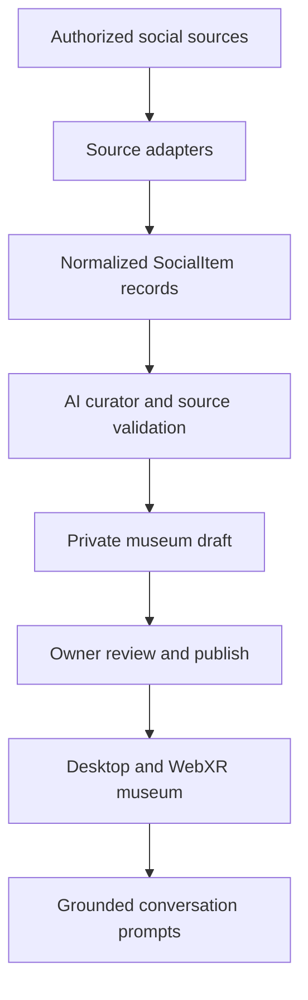

# MemoryVerse — Product Requirements Document

**Version:** 1.0  
**Date:** September 25, 2026  
**Status:** Hackathon build specification  
**Timebox:** 36 hours  
**Product:** A consent based, AI curated social museum for desktop and VR

## 1. Product summary

MemoryVerse turns a person's connected social media history into an explorable museum. Its AI identifies meaningful memories and recurring themes, groups them into personal chapters, and creates rooms that visitors can explore on a laptop or in a Meta Quest browser. After a visit, it offers grounded questions that help two people talk to each other more deeply.

**One sentence pitch:** Connect your digital life, step into your story, and give friends a better way to know you.

The owner connects accounts; they do **not** upload, paste, or manually assemble memories. The owner reviews the generated museum and chooses what to share. A visitor can explore only the published version.

## 2. Problem and opportunity

Social profiles present fragments in reverse chronological feeds. Visitors can see what happened but often miss the context, connections, and transitions that give a life its shape. Creating that story by hand takes too much effort. MemoryVerse uses AI to organize existing digital traces into an experience that ends with a real conversation.

The product hypothesis is that **an explorable, evidence backed account of a person's experiences produces more specific, meaningful conversation than browsing their conventional profile**.

## 3. Goals and measures

| Goal | Hackathon measure |
| --- | --- |
| Create a museum automatically | A connected owner's accessible social data produces a valid museum without manual content entry. |
| Make the story recognizable | The owner approves the displayed room titles and artifact descriptions during a short review. |
| Support immersive and accessible exploration | The same published museum works with desktop navigation and Quest Browser VR interaction. |
| Strengthen connection | A visitor sees at least three specific, artifact linked questions after exploring. |
| Demonstrate end to end reliability | The team can repeat the connection → generation → review → visit → conversation demo on a deployed HTTPS URL. |

These are prototype validation measures, not claims of measured long term social impact.

## 4. Users and core jobs

| User | Job | Desired outcome |
| --- | --- | --- |
| Museum owner | Connect selected social accounts and review the AI's interpretation. | A museum that feels accurate and is safe to share. |
| Visitor | Explore a friend's published museum. | Understand what matters to the owner and find a natural question to ask. |
| Returning owner | Revisit and change what is shared. | Remain in control of their story. |

## 5. Scope

### Hackathon MVP — required

1. Owner connects an available social account through a consent based account connection flow. The interface accurately reflects which sources are actually connected; the pipeline accepts multiple sources through one normalized format.
2. Import at least one owner's **real, authorized** posts or media metadata through a working source adapter. Normalize items, deduplicate them, and preserve source references. The owner does not paste or upload items.
3. Generate three to five personalized chapters and two to four artifacts per chapter. Each artifact links to an imported item or a clearly labeled synthesized interpretation.
4. Provide a review screen where the owner can hide artifacts and chapters, edit displayed text, and publish deliberately. The initial museum is private.
5. Render the published museum as an interactive 3D experience on desktop and in Quest Browser. A desktop fallback includes keyboard/mouse or touch navigation.
6. Let a visitor select artifacts to see their story and source context. Show three grounded conversation prompts after the visit.
7. Provide a shareable URL for the published museum, with server side enforcement of the published visibility state.

### Stretch goals — only after the complete MVP works

- Additional real connectors (for example Instagram, Facebook, TikTok, Spotify), subject to actual data access.
- Voice narration, spatial audio, richer environments, owner approved visitor reflections.
- Connection Mode comparing two consenting owners' *published or explicitly shared* themes.
- Friends only or room level access controls.

### Out of scope for 36 hours

Native Quest app, multiplayer avatars, arbitrary public profile scraping, password collection by MemoryVerse, background monitoring, inferred private messages, full video processing at scale, automatic publication, and predictive claims about a person's future or mental state.

## 6. User journeys

### Owner: create and share

1. Land on **Build my world** and see what access the app requests and how the result may be shared.
2. Connect one or more supported accounts through their authorized connection flow.
3. See true import progress and actual source counts. If a platform supplies no accessible items, see a clear reason and retry option.
4. Select **Build my museum**. The app filters and analyzes available traces, then proposes a museum.
5. Review the rooms, artifacts, captions, and provenance. Hide or edit sensitive or inaccurate material.
6. Choose **Publish** and receive a shareable link. The unreviewed draft is never visitor accessible.

### Visitor: explore and connect

1. Open a published link and read a short orientation.
2. Explore on desktop, or select **Enter VR** on a compatible headset.
3. Move among rooms and select artifacts for images, short narratives, dates, and the owner's approved context.
4. Finish at **Continue the conversation** to see three questions tied to specific published artifacts or themes.
5. Start a conversation with the owner outside the app. The MVP does not send a message on the visitor's behalf.

## 7. Functional requirements

| ID | Requirement | Acceptance criterion |
| --- | --- | --- |
| FR-01 | Connect and import | A consenting test owner connects a supported account and receives at least one imported item with stable ID, platform, timestamp when available, and provenance. No social password is entered into MemoryVerse. |
| FR-02 | Normalize | Adapters produce `SocialItem[]`; missing captions, dates, and media are handled without crashing. Duplicates do not create duplicate artifacts. |
| FR-03 | Curate | The system selects a bounded set of candidate items, finds recurring themes and milestones, and generates 3–5 specific chapters rather than fixed generic categories. |
| FR-04 | Ground interpretations | Every artifact records its source item IDs; a room narrative identifies the supporting artifacts. Unsupported personal assertions are excluded or presented as tentative interpretations for owner review. |
| FR-05 | Owner review | The owner can hide an artifact or room and edit displayed text before publishing; changes persist and affect the visitor view. |
| FR-06 | Publishing | Museums start private. An explicit publish action makes the approved version accessible via a share URL; unpublish revokes visitor access. |
| FR-07 | Museum exploration | Desktop users can navigate and inspect every published artifact; Quest users can enter VR, move between rooms, and select the same artifacts with available controllers or gaze interaction. |
| FR-08 | Conversation outcome | The final screen displays three distinct, specific prompts, each traceable to a published memory or chapter, without revealing hidden source material. |
| FR-09 | Recovery | If import or generation fails, the owner sees a useful error and can retry without losing an already generated draft. |
| FR-10 | Honest source status | Each connected platform and item count reflects real integration output. Any demo fixture is clearly marked as sample data and is never presented as a live import. |

## 8. AI behavior

**Input:** Accessible, consented social items. Captions, post metadata, media previews, and timestamps may vary by platform. The AI must not assume unavailable private data exists.

**Pipeline:**

1. Normalize source records and remove duplicates.
2. Rank candidates for narrative usefulness using coverage across time, meaningful captions, media availability, recurring entities, and distinct events. Engagement can be a signal but must not determine importance alone.
3. Analyze selected items in bounded batches; apply image understanding only when media is available and authorized.
4. Extract evidenced people, places, interests, events, and themes with source IDs and confidence. Do not infer sensitive traits or psychological diagnoses.
5. Propose chapters, narratives, artifacts, and prompts from those supported findings.
6. Validate the output against a schema and source IDs; reject or regenerate invalid or ungrounded entries.
7. Present the draft for owner approval.

The “identity graph” is an internal JSON representation of entities and source linked relationships; a graph database is unnecessary for the prototype. The AI may suggest an interpretation, but the museum does not portray an inference as an established fact about the owner.

## 9. Data contracts

```ts
type SocialItem = {
  id: string;                    // Stable within source
  platform: string;
  kind: "photo" | "video" | "post" | "music" | "profile";
  text?: string;
  mediaUrl?: string;              // Only when access and display rights allow
  timestamp?: string;             // ISO 8601
  sourceUrl?: string;
  metadata?: Record<string, unknown>;
};

type Artifact = {
  id: string;
  type: "image" | "video_link" | "quote" | "text" | "music";
  title: string;
  caption: string;
  interpretation?: string;
  sourceIds: string[];            // IDs from authorized SocialItem records
  mediaUrl?: string;
  conversationPrompt?: string;
  visible: boolean;
};

type Museum = {
  id: string;
  ownerId: string;
  title: string;
  summary: string;
  status: "draft" | "published";
  rooms: Array<{
    id: string;
    title: string;
    narrative: string;
    theme: string;
    artifacts: Artifact[];
    visible: boolean;
  }>;
};
```

**Invariant:** Every published artifact with a factual claim must have a source ID or owner supplied correction. A media URL is optional; the XR view must render a readable text artifact when an image is unavailable.

## 10. Experience and interface

| Surface | Required content / interaction |
| --- | --- |
| Landing | Clear value proposition, **Build my world**, **Visit a world**, privacy explanation. |
| Connect | Supported platform options, permission summary, connected status, actual import counts. |
| Building | Stage based progress from import through curation; no invented people or memory counts. |
| Review | Room list, artifact previews, source context, hide/edit controls, explicit publish action. |
| Museum | Three to five distinct rooms; legible titles, selectable artifacts, simple navigation, desktop and VR entry. |
| Connection | Three prompts tied to published evidence and a way to revisit the referenced artifact. |

Use a consistent room template whose colors, lighting, labels, and selected objects change with the chapter. Keep text large and high contrast in VR. Provide a visible exit and a way to return to the room list; interaction must not require precise hand tracking.

## 11. Privacy, consent, and trust

- The account owner authorizes each source through that platform's supported mechanism. MemoryVerse never requests social account passwords directly.
- Imported data and generated drafts are private by default. Publishing requires a review and deliberate action.
- Show the origin of each artifact and allow the owner to hide it. Do not expose hidden artifacts or raw imports in public page payloads or visitor AI prompts.
- A visitor may access only the published museum. If two owner histories are compared, both owners must expressly opt in to the data used for comparison.
- Avoid naming or profiling nonconsenting third parties in generated copy; use neutral phrasing unless the owner approves names.
- Provide disconnect, unpublish, and delete controls. For the prototype, delete stored source data and derived museum data associated with that owner; document any remaining provider side data separately.
- Treat model output as untrusted: validate its structure, source references, lengths, and media URLs before rendering.

## 12. Architecture and dependencies



**Suggested implementation:** Next.js for web UI and API routes; a server side database for owner, source metadata, draft, and published museum; a structured output capable multimodal model for curation; A-Frame/WebXR for the shared desktop and headset scene; HTTPS hosting. The browser renderer consumes `Museum` JSON and has no knowledge of social platform payloads.

**Critical dependency:** Logging in or granting consent does **not**, by itself, guarantee a platform exposes historical photos, captions, videos, or media URLs to this app. Data coverage depends on actual platform permissions, developer access, scopes, and display rules. Validate one real authorized import at the start of the hackathon. The product architecture accepts all intended social sources, while the demo must accurately identify which integrations truly work.

**Media handling:** Expiring URLs, cross origin restrictions, unavailable media, and platform display rules can prevent direct textures in XR. Prefer permitted durable media references where available and fall back to source linked text cards.

## 13. 36-hour delivery plan and gates

| Time | Deliverable | Gate |
| --- | --- | --- |
| 0–2 h | Freeze schemas, sample museum, ownership, and deployed skeleton. | All workstreams can build against the same contracts. |
| 2–7 h | One real connector; AI curator against fixture `SocialItem[]`; XR renderer against fixture `Museum`; review UI. | Import, generation, and renderer work independently. |
| 7–12 h | Join the three stages and persist the draft. | A connected test account's accessible items appear in a generated museum. |
| 12–18 h | Owner review, publish, desktop navigation, artifact details, conversation prompts. | Complete end to end desktop demo. |
| 18–26 h | Quest interaction, performance, media fallbacks, visual refinement. | Deployed HTTPS URL works in headset and on laptop. |
| 26–32 h | Repeat demo, fix failures, prepare short story led pitch and backup recording. | Another teammate can run the demo without developer intervention. |
| 32–36 h | Feature freeze, regression check, submission assets. | Submission matches what actually works. |

**Parallel ownership:** (1) source adapters and normalization; (2) AI curation and validation; (3) XR renderer; (4) web UX, persistence, integration, and demo. Keep interfaces stable before parallel implementation.

## 14. Definition of done

The MVP is done when an owner connects a genuinely working, consented social source; the app imports accessible items without manual entry; AI generates an evidence linked private draft; the owner reviews and publishes it; a visitor can explore the approved museum on desktop and Quest; and the visitor gets three grounded conversation starters. The same deployed flow should run twice with no developer edits between runs.

If a source is unavailable, a clearly labeled sample museum may demonstrate the renderer, but it does **not** satisfy the live import criterion. Additional connectors and social overlap remain stretch goals until the full flow passes.

## 15. Open product decisions

1. Which platform can provide a real, authorized dataset to the team at the event? Test the exact accessible fields and media URLs before choosing the lead connector.
2. What is the owner's minimum review control for first release: hide and edit artifacts only, or full room rearrangement? This PRD requires hide and edit.
3. What published information can Connection Mode compare if two people opt in? This PRD limits the MVP to museum specific questions and defers cross person comparison.
4. What is the prototype's retention period for imported source items? Set a concrete duration before collecting real participant data.

## 16. Demo narrative

Show a consenting teammate connecting an account and watching real imported items become a draft. Review one interpretation, hide one artifact, and publish. On desktop and Quest, enter a chapter, select an artifact, and show its original context. Finish with a question that refers to that artifact and can start a conversation with the teammate. Describe any unavailable connectors as planned integrations, not completed features.
